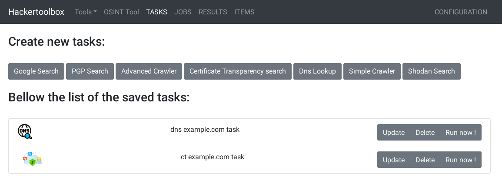
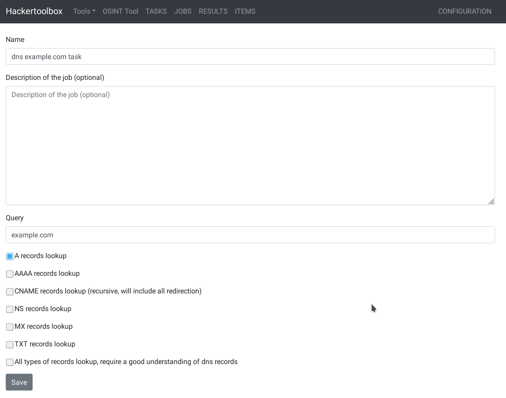
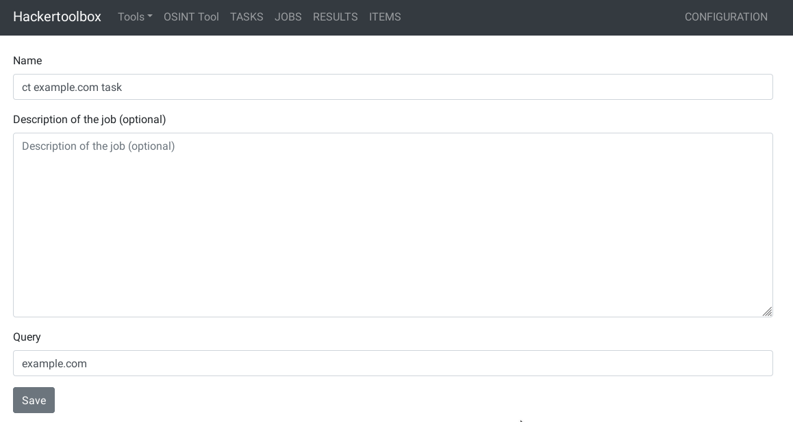
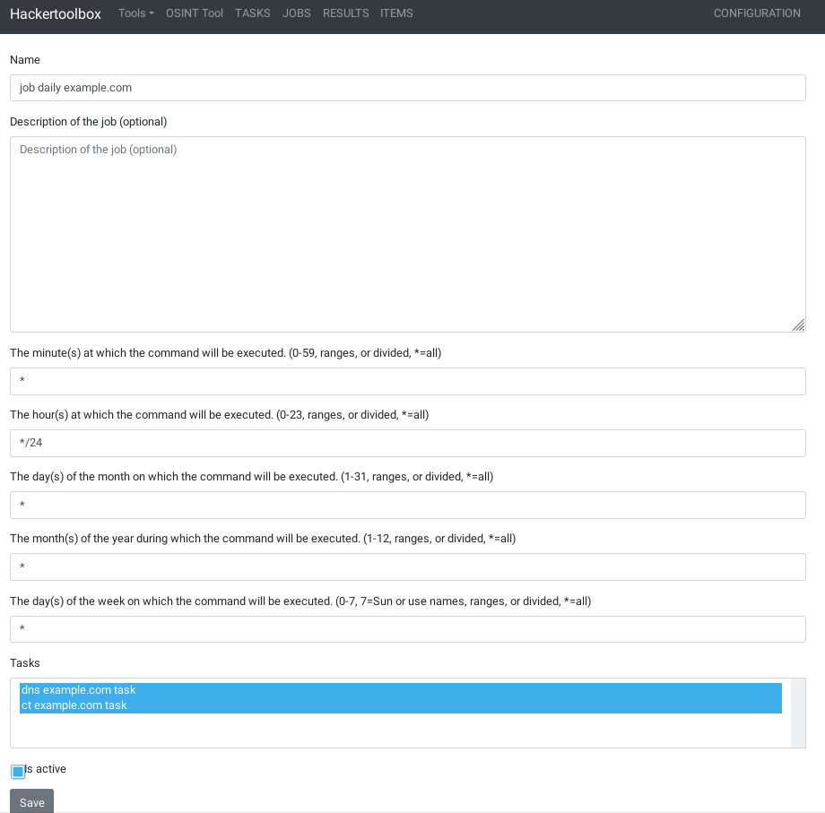
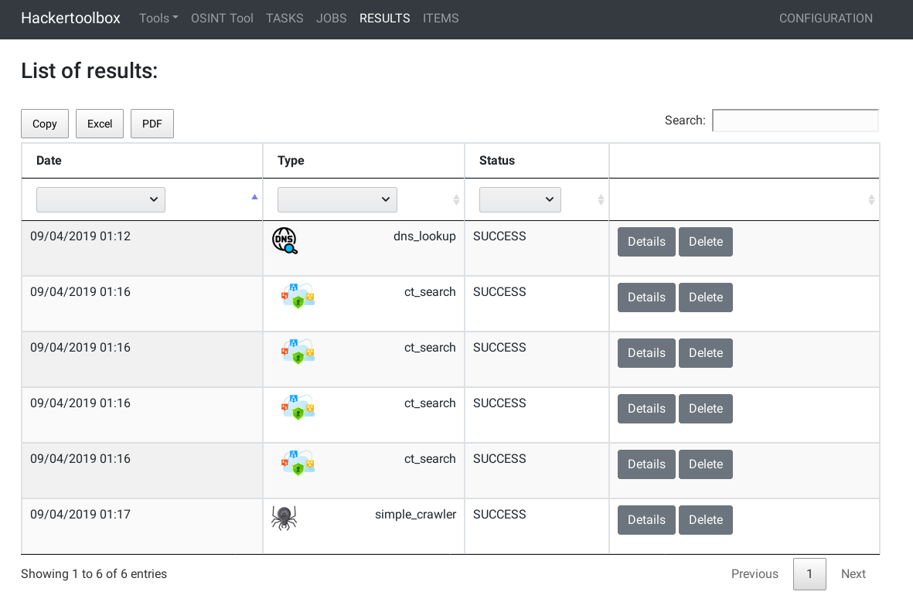
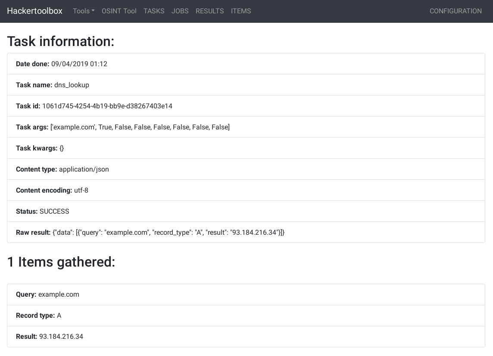
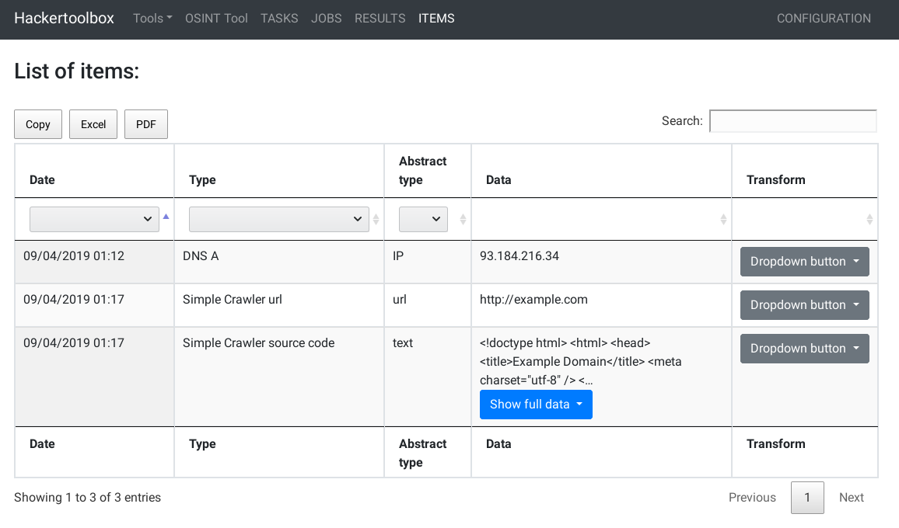
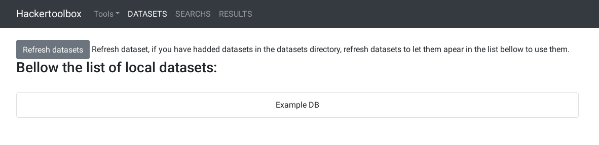
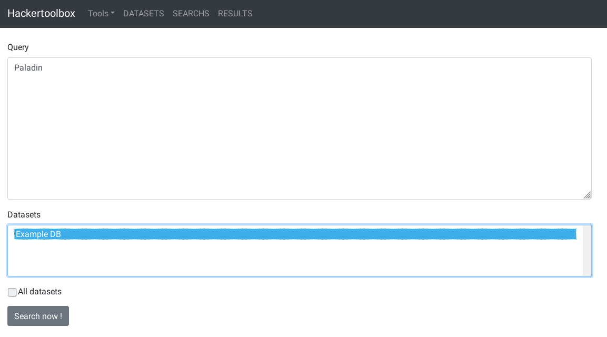
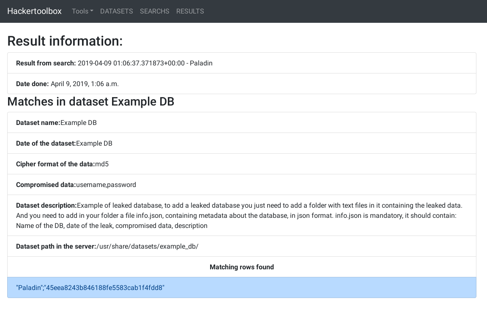

# Hackertoolbox 
## Introduction
This project is a tool for lazy hackers. It has been done to automate some tasks with a tool easy to use with a web interface. 
## Components of this project
### OSINT tool
One of the component of this tool is a tool to make osint easyer.
You can automate and schedule multiple OSINT tasks like:
- Google search
- PGP key search
- DNS lookup
- Crawl websites
- Certificate Transparency logs search
- Shodan search

The web interface show the results in a way to make analysis, correlations, and exports of the datas as easy as possible.
#### Example:
If you want to gather information about a domain name called example.com for example. You can set up 2 tasks:
- A DNS lookup on the domain example.com
- a Certificate Transparency search on example.com

Once those 2 tasks are created, you can run them imediatly. Or to follow changes on the infrastructure of thoses domains, you can create a job that will launch thoses 2 tasks every day.

When you need to look at the gathered data, you can view results of each task in the Results cathegory, or view all the data gathered in the Item cathegory.
In the Item cathegory, you can filter interesting data by type, date, or query.
Then you can launch other task from a data in Item, for example a shodan search on a domain obtained by DNS lookup.

You can filter to keep interesting data, and then you can export it in csv or pdf to share it to people or use the data in other tools.
### Search in local datasets tools
This component is to make the search in local dataset easy and fast. 
This tool use the sift program to run a fast search in text files (https://sift-tool.org/). sift is a tool that search much faster than grep.
#### Example
If you have collected leaked databases in text format, you can put them in a folder in /usr/share/datasets/ folder.

Then just add a file called info.json in the folder of your added dataset, in this file keep metadata in json format about your dataset. ( you can see an example in example-db )

Then, in the interface you can refresh the datasets, it will show you the dataset you just added.
In the Search cathegory you can then search for a query and select in what dataset you want your search to be done.

As soon as the search end, the result will be available in the Result cathegory, with the metadata associated with the dataset where you found a result, letting you know for example what is the cipher algorithm for the hash found for example.

## Installation
The installation has been tested in Debian sid (march 2019)
### Dependancies
Install python3 version > 3.6 and pip
```
sudo apt install python3 python3-pip
```

Install redis-server, redis is used as a message broker for communicating between the daemon of the tools and the interface
```
sudo apt install redis-server
```

Install chromium-driver, it will be used by the advanced crawler tool to do browser simulation.
```
sudo apt install chromium-driver
```

### Clone the project:
```
git clone https://github.com/0p1um/hackertoolbox.git
```

### Move in the project folder
```
cd hackertoolbox
```

### Install using pip
To install this project with pip you need to do it as root. With the following command:
```
sudo pip3 install --no-binary :all: .
```

The options --no-binary :all: are mandatory for the installation to avoid a bug in wheel when using absolute path during installation

### Initialize project
To start using this project you need to initialize the database, and install all services and configuration files needed. 
Run this command as root to do it:
```
sudo hackertoolboxctl init
```

## Usage
You can manage hackertoolbox by using the command hackertoolboxctl as root
For exemple, to start all the component of hackertoolbox do:
```
sudo hackertoolboxctl start
```

To stop the web interface do:
```
sudo hackertoolboxctl stop -e interface
```

Do hackertoolboxctl -h to see the help of the command and all the options you can use.

## Screenshots

### OSINT tool
Tasks:


Create DNS lookup task:


Create Certificate Transparency task:


Create OSINT scheduled job:


OSINT Tasks results list view:


DNS lookup result:


Tasks data gathered items view:


### Search in local datasets

Datasets view:


Create search in local datasets:


Result of search:



## License

    This file is part of Hackertoolbox.

    Hackertoolbox is free software: you can redistribute it and/or modify
    it under the terms of the GNU General Public License as published by
    the Free Software Foundation, either version 3 of the License, or
    (at your option) any later version.

    Hackertoolbox is distributed in the hope that it will be useful,
    but WITHOUT ANY WARRANTY; without even the implied warranty of
    MERCHANTABILITY or FITNESS FOR A PARTICULAR PURPOSE.  See the
    GNU General Public License for more details.

    You should have received a copy of the GNU General Public License
    along with Hackertoolbox.  If not, see <https://www.gnu.org/licenses/>.
